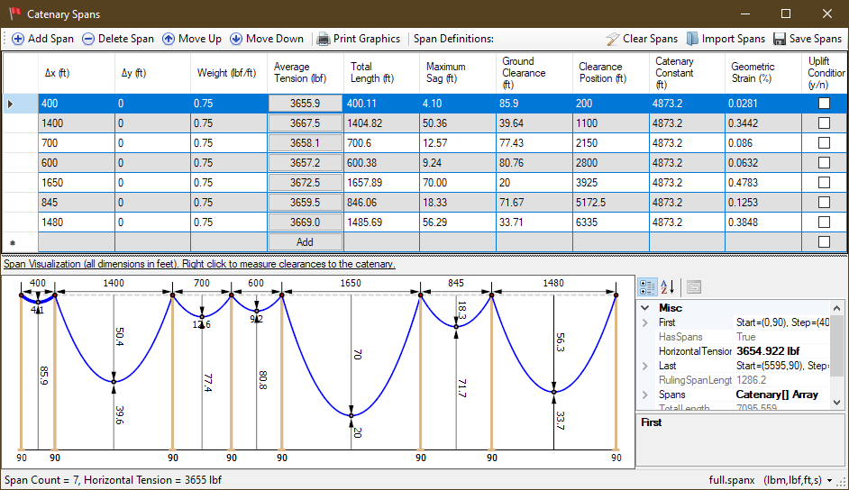

# CatenarySpans
Desktop application for the shape of a single cable hanging from multiple support points at different span lengths and heights. The shape of a hanging cable is that of catenary and this program finds the catenary parameters needed to _exactly_ pass through all the support points. 

The user can add, edit and remove supports and if the project is saved to a file it will be read next time the application runs. The horizontal cable tension is shared among all the spans, and it can be set from each span by prescribing either the catenary constant, the maximum sag, the clearance, cable length, or more commonly the average tension. See the span detail dialog below for how this is done. Tower uplift calculations are done also.

Finally, the user can produce a printout of the cable with a graphical reprentation of all the spans and a data table that includes all the relevent values.

# Screenshots

 - Main Screen

   
   
 - Span Details

   
   
 - Printout

      
   
 # Development
 
 `C#` application in `WinForms` built in `VS2017`.  Project
 includes source files and unit tests.
 
 # Mathematics
 
 The general shape of hanging cable is that of a catenary described by the **cosh(x)** function 
 or more specifically the equation below:
 
  
  
  The program can find the parameters of this equation to fit between the support points even 
  when the span is not even. In addition, the tension needed can be found for a specific clearance or sag amount.
