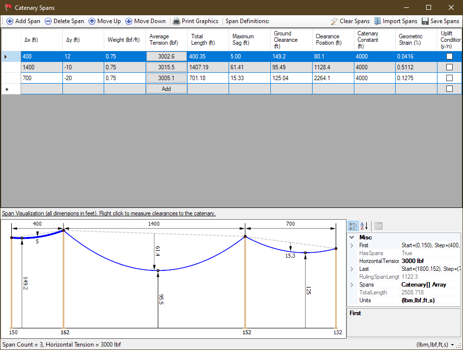
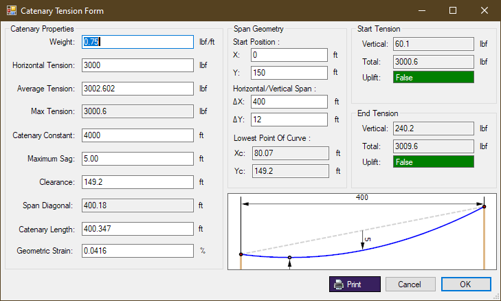
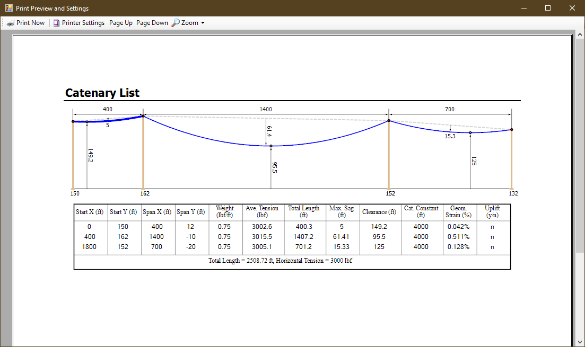

# CatenarySpans
Desktop application for the shape of hanging cable among multiple support points

# Screenshots

 - Main Screen

   
   
    - Span Details

   
   
 - Printout

      
   
 # Development
 
 `C#` application in `WinForms` built in `VS2017`.  Project
 includes source files and unit tests.
 
 
 
 
 
 